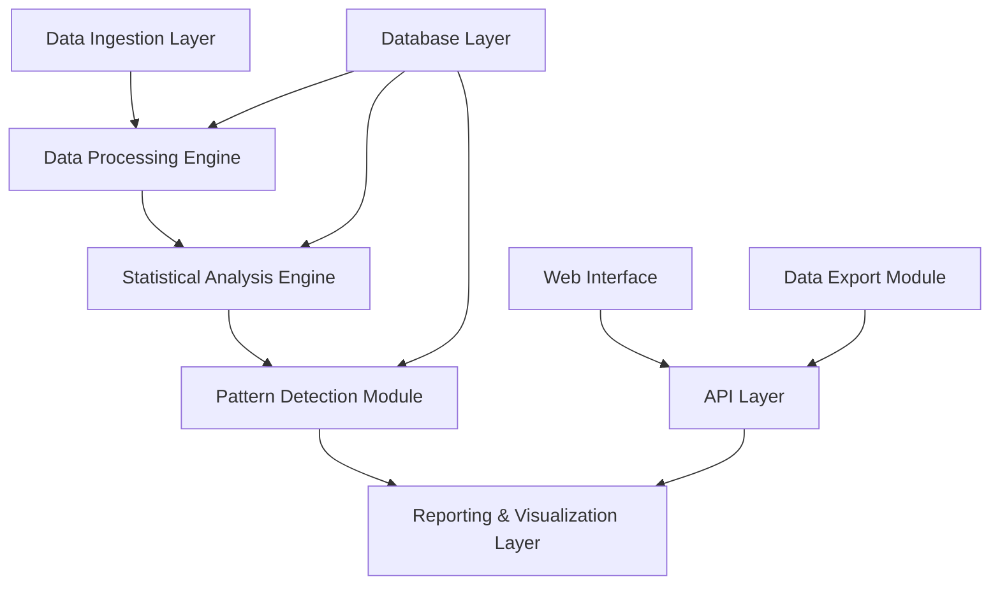

# Design Document

## Overview

The Multi-Sport Referee Statistics System is a data-driven analytics platform designed to analyze referee behavioral patterns in ice hockey and floorball. The system processes match data to identify bias patterns, penalty tendencies, and timing behaviors that can inform strategic decision-making for coaches, league administrators, and sports analysts.

The core architecture follows a data pipeline approach: data ingestion → statistical processing → pattern analysis → reporting/visualization.

## Architecture

### System Components



### Technology Stack

**Backend:**
- **Database:** PostgreSQL with TimescaleDB extension for time-series penalty data
- **API Framework:** FastAPI (Python) for high-performance data processing
- **Statistical Processing:** pandas, numpy, scipy for statistical analysis
- **Background Jobs:** Celery with Redis for batch processing

**Frontend:**
- **Framework:** Next.js with TypeScript
- **Visualization:** Chart.js or D3.js for statistical charts and graphs
- **UI Components:** Tailwind CSS for responsive design

**Infrastructure:**
- **Containerization:** Docker for development and deployment
- **Data Pipeline:** Apache Airflow for scheduled data processing jobs

## Components and Interfaces

### 1. Data Ingestion Layer

**Purpose:** Import and validate match data from various sources

**Key Classes:**
```python
class MatchDataImporter:
    def import_csv_data(self, file_path: str, sport_type: SportType) -> List[Match]
    def validate_match_data(self, match_data: Dict) -> ValidationResult
    def normalize_penalty_types(self, penalties: List[Penalty], sport: SportType) -> List[Penalty]

class DataValidator:
    def validate_referee_assignment(self, match: Match) -> bool
    def validate_penalty_timing(self, penalty: Penalty, match: Match) -> bool
    def check_data_completeness(self, match: Match) -> ValidationReport
```

### 2. Statistical Analysis Engine

**Purpose:** Calculate bias metrics, trends, and statistical significance

**Key Classes:**
```python
class BiasAnalyzer:
    def calculate_team_bias(self, referee_id: int, team_id: int) -> TeamBiasMetrics
    def calculate_home_away_bias(self, referee_id: int) -> HomeAwayBiasMetrics
    def calculate_penalty_patterns(self, referee_id: int) -> PenaltyPatternMetrics
    def calculate_betting_insights(self, referee_id: int) -> BettingInsightMetrics

class StatisticalProcessor:
    def calculate_confidence_intervals(self, data: List[float]) -> ConfidenceInterval
    def perform_significance_testing(self, sample1: List, sample2: List) -> SignificanceTest
    def calculate_league_averages(self, sport: SportType, season: str) -> LeagueAverages
```

### 3. Pattern Detection Module

**Purpose:** Identify unusual patterns and generate alerts

**Key Classes:**
```python
class PatternDetector:
    def detect_unusual_penalty_timing(self, referee_id: int) -> List[TimingAnomaly]
    def detect_significant_bias(self, referee_id: int) -> List[BiasAlert]
    def identify_outlier_referees(self, metric_type: MetricType) -> List[OutlierReferee]

class TrendAnalyzer:
    def analyze_seasonal_trends(self, referee_id: int) -> SeasonalTrends
    def compare_referee_evolution(self, referee_id: int, seasons: List[str]) -> EvolutionMetrics
```

## Data Models

### Core Entities

```python
@dataclass
class Referee:
    id: int
    name: str
    sports_certified: List[SportType]
    career_start_date: date
    active: bool

@dataclass
class Team:
    id: int
    name: str
    sport: SportType
    league: str
    home_venue: str

@dataclass
class Match:
    id: int
    date: datetime
    sport: SportType
    home_team_id: int
    away_team_id: int
    referee_ids: List[int]  # Main referee + linesmen
    final_score_home: int
    final_score_away: int
    venue: str
    season: str

@dataclass
class Penalty:
    id: int
    match_id: int
    referee_id: int
    team_id: int
    player_name: str
    penalty_type: PenaltyType
    period: int
    time_in_period: str  # MM:SS format
    duration_minutes: int
    game_situation: GameSituation  # Even strength, power play, etc.

@dataclass
class BiasMetrics:
    referee_id: int
    team_bias_scores: Dict[int, float]  # team_id -> bias_score
    home_away_bias: float
    penalty_rate_deviation: float
    statistical_significance: float
    confidence_level: float
```

### Statistical Models

```python
@dataclass
class TeamBiasMetrics:
    team_id: int
    referee_id: int
    games_officiated: int
    team_win_percentage: float
    league_average_win_percentage: float
    penalty_differential: float  # Penalties against team vs opponents
    statistical_significance: float

@dataclass
class PenaltyPatternMetrics:
    referee_id: int
    penalty_type_frequencies: Dict[PenaltyType, float]
    timing_distribution: Dict[int, float]  # period -> percentage
    game_situation_bias: Dict[GameSituation, float]
    deviation_from_league_average: float

@dataclass
class BettingInsightMetrics:
    referee_id: int
    average_total_penalties_per_game: float
    over_under_trend: float  # Tendency toward high/low scoring games
    home_team_win_percentage: float
    average_game_length: float  # Including overtime frequency
    penalty_shot_frequency: float
    ejection_frequency: float
```

## Error Handling

### Data Validation Errors
- **Invalid penalty timing:** Log error and flag for manual review
- **Missing referee assignments:** Reject match data with clear error message
- **Inconsistent team data:** Attempt auto-correction, flag for verification

### Statistical Calculation Errors
- **Insufficient data:** Return confidence intervals with appropriate warnings
- **Division by zero:** Handle gracefully with null/undefined indicators
- **Outlier detection:** Flag extreme values for manual verification

### API Error Responses
```python
class APIErrorResponse:
    error_code: str
    message: str
    details: Optional[Dict]
    timestamp: datetime
```

## Testing Strategy

### Unit Testing
- **Statistical calculations:** Verify bias calculations with known datasets
- **Data validation:** Test edge cases and malformed data handling
- **Pattern detection:** Test with synthetic data containing known patterns

### Integration Testing
- **Data pipeline:** End-to-end testing from import to report generation
- **API endpoints:** Test all CRUD operations and statistical queries
- **Database operations:** Test complex queries and data integrity

### Performance Testing
- **Large dataset processing:** Test with multiple seasons of data
- **Concurrent user access:** Load testing for report generation
- **Statistical computation speed:** Benchmark complex bias calculations

### Test Data Strategy
```python
class TestDataGenerator:
    def generate_biased_referee_data(self, bias_type: BiasType) -> List[Match]
    def create_neutral_referee_dataset(self, num_matches: int) -> List[Match]
    def generate_penalty_pattern_data(self, pattern_type: PatternType) -> List[Penalty]
```

## API Design

### Core Endpoints

**Referee Analysis:**
- `GET /api/referees/{id}/bias-analysis` - Complete bias analysis for a referee
- `GET /api/referees/{id}/penalty-patterns` - Penalty calling patterns
- `GET /api/referees/{id}/team-history/{team_id}` - Historical data with specific team

**Team Preparation:**
- `GET /api/teams/{id}/referee-matchups` - Historical performance with different referees
- `GET /api/matches/{id}/referee-preview` - Pre-game referee analysis for coaches

**Betting & Fan Insights:**
- `GET /api/matches/{id}/betting-insights` - Referee impact on game outcomes and totals
- `GET /api/referees/{id}/over-under-trends` - Historical over/under performance with referee
- `GET /api/referees/{id}/penalty-totals` - Average penalty minutes per game trends
- `GET /api/matches/{id}/referee-impact-score` - Quantified referee impact on game flow

**League Analytics:**
- `GET /api/leagues/{league}/referee-rankings` - Referee consistency rankings
- `GET /api/leagues/{league}/bias-alerts` - Current bias alerts and flags

**Reporting:**
- `GET /api/reports/referee-summary/{id}` - Comprehensive referee report
- `GET /api/reports/fan-betting-guide/{match_id}` - Fan-friendly betting insights report
- `POST /api/reports/custom-analysis` - Custom statistical analysis requests